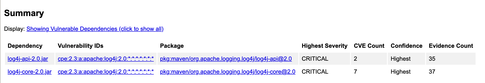
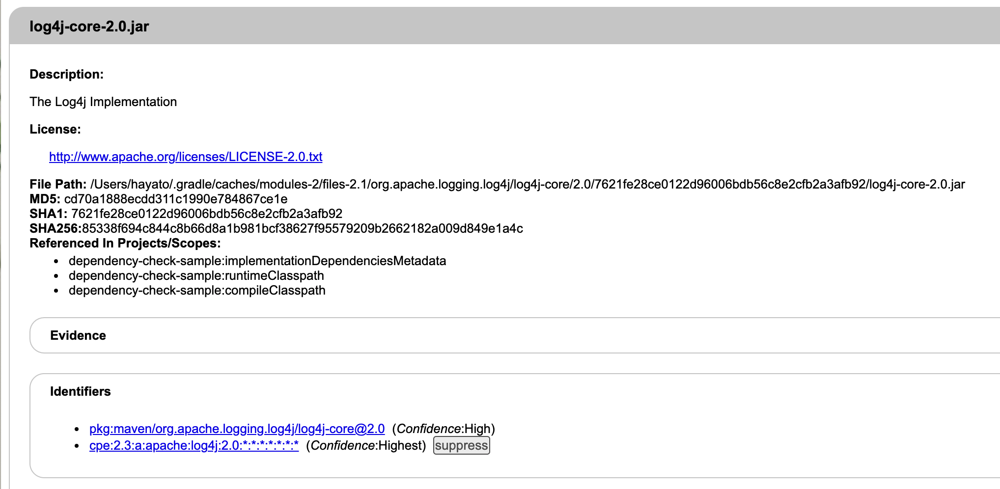
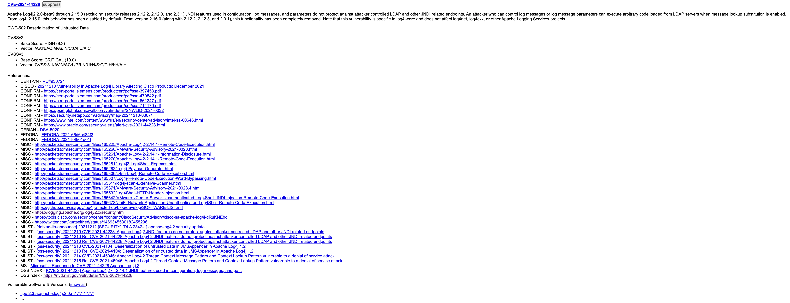
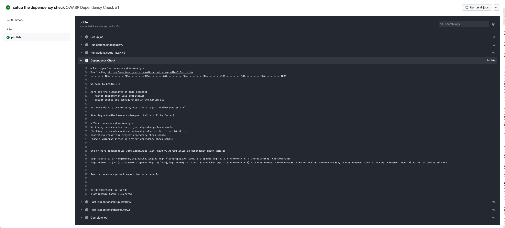

# Dependency Check Sample
[OWASP Dependency Check](https://jeremylong.github.io/DependencyCheck/)を使用したサンプルレポジトリです。

## OWASP Dependency Checkとは？
- [OWASP](https://owasp.org/www-chapter-japan/): ソフトウェアセキュリティに関する情報共有やツール開発などを行っている非営利団体
- [OWASP Dependency Check](https://jeremylong.github.io/DependencyCheck/): アプリケーションの依存関係に対し、既知の脆弱性が含まれているかスキャンするソフトウェア
  - 対応アプリケーション:
    - 正式サポート:
      - .NET
      - Java
    - Experimental:
      - Python
      - Ruby
      - PHP
      - Node.js
  - 脆弱性データベース: [NVD](https://nvd.nist.gov/)
  - 利用手段:
    - Ant Task
    - Command Line Tool
    - Gradle Plugin
    - Jenkins Plugin
    - Maven Plugin (Maven 3.1 or newer required)
    - SBT Plugin

## Gradle Pluginでの使用方法
### 準備
`build.gradle.kts`内の`plugins`ブロックに以下の記述をする

```kotlin
plugins {
    id("org.owasp.dependencycheck") version "<version>"
}
```

今回は脆弱性検知のため、CVE-2021-44228などを含むLog4j Coreの2.0を依存関係に追加する

```kotlin
dependencies {
    // contains vulnerabilities
    implementation("org.apache.logging.log4j", "log4j-core", "2.0")
}
```

なおlog4j-coreはlog4j-apiに依存している

```text
runtimeClasspath - Runtime classpath of compilation 'main' (target  (jvm)).
+--- org.jetbrains.kotlin:kotlin-stdlib:1.5.31
|    +--- org.jetbrains:annotations:13.0
|    \--- org.jetbrains.kotlin:kotlin-stdlib-common:1.5.31
\--- org.apache.logging.log4j:log4j-core:2.0
     \--- org.apache.logging.log4j:log4j-api:2.0
```

本レポジトリ内の[build.gradle.kts](./build.gradle.kts)が上記を含んだ形となるため、本レポジトリをCloneすることで動作確認可能

### Tasks
OWASP Dependency CheckのGradle Pluginには以下の4つのタスクが準備されている
- dependencyCheckAnalyze: Runs dependency-check against the project and generates a report.
- dependencyCheckAggregate: Runs dependency-check against a multi-project build and generates a report.
- dependencyCheckUpdate: Updates the local cache of the NVD data from NIST.
- dependencyCheckPurge: Deletes the local copy of the NVD. This is used to force a refresh of the data.

各タスクと設定についての詳しい説明は[こちら](https://jeremylong.github.io/DependencyCheck/dependency-check-gradle/configuration.html)

### dependencyCheckAnalyze
では実際にdependencyCheckAnalyzeを実行して脆弱性を検知していく  
実行した結果が以下の通り

```shell
$ ./gradlew dependencyCheckAnalyze

> Task :dependencyCheckAnalyze
Verifying dependencies for project dependency-check-sample
Checking for updates and analyzing dependencies for vulnerabilities
----------------------------------------------------
.NET Assembly Analyzer could not be initialized and at least one 'exe' or 'dll' was scanned. The 'dotnet' executable could not be found on the path; either disable the Assembly Analyzer or add the path to dotnet core in the configuration.
----------------------------------------------------
Generating report for project dependency-check-sample
Found 9 vulnerabilities in project dependency-check-sample


One or more dependencies were identified with known vulnerabilities in dependency-check-sample:

log4j-api-2.0.jar (pkg:maven/org.apache.logging.log4j/log4j-api@2.0, cpe:2.3:a:apache:log4j:2.0:*:*:*:*:*:*:*) : CVE-2017-5645, CVE-2020-9488
log4j-core-2.0.jar (pkg:maven/org.apache.logging.log4j/log4j-core@2.0, cpe:2.3:a:apache:log4j:2.0:*:*:*:*:*:*:*) : CVE-2017-5645, CVE-2020-9488, CVE-2021-44228, CVE-2021-44832, CVE-2021-45046, CVE-2021-45105, CWE-502: Deserialization of Untrusted Data


See the dependency-check report for more details.


BUILD SUCCESSFUL in 6s
1 actionable task: 1 executed
```

> Found 9 vulnerabilities in project dependency-check-sample

9つの脆弱性が含まれていることを示している

> log4j-api-2.0.jar (pkg:maven/org.apache.logging.log4j/log4j-api@2.0, cpe:2.3:a:apache:log4j:2.0:*:*:*:*:*:*:*) : CVE-2017-5645, CVE-2020-9488

> log4j-core-2.0.jar (pkg:maven/org.apache.logging.log4j/log4j-core@2.0, cpe:2.3:a:apache:log4j:2.0:*:*:*:*:*:*:*) : CVE-2017-5645, CVE-2020-9488, CVE-2021-44228, CVE-2021-44832, CVE-2021-45046, CVE-2021-45105, CWE-502: Deserialization of Untrusted Data

dependencyごとにどういった脆弱性(CVE)があるかを示している  
前述の通り、[build.gradle.kts](./build.gradle.kts)にはlog4j-coreの依存関係しか追加していないが、log4j-coreが内部的に依存しているlog4j-apiの脆弱性も検知することができている

#### HTMLレポート
dependencyCheckAnalyzeタスクを実行するとデフォルトでは`build/reports`配下に`dependency-check-report.html`というHTMLファイルが出力される
本レポジトリでは[./reports/dependency-check-report.html](./reports/dependency-check-report.html)に上記ファイルを置いたのでそちらをご参考に

上記htmlを開くと脆弱性チェックの結果がUIで確認することができる  
ページ内の各ブロックについてみていく



Summaryブロックでは依存関係ごとの脆弱性概要を確認することができる



依存関係ごとの概要情報が表示される



脆弱性ごとの脆弱性概要が表示される

#### JSONレポート
デフォルトではHTML形式でレポートが出力されるがJSON形式での出力も可能  
以下の内容を`build.gradle.kts`へ追加する

```kotlin
tasks {
    dependencyCheck {
        format = org.owasp.dependencycheck.reporting.ReportGenerator.Format.JSON
    }
}
```

出力結果はHTML形式と同様に`build/reports`配下へ保存される  
本レポジトリでは[./reports/dependency-check-report.json](./reports/dependency-check-report.json)に上記ファイルを置いたのでそちらをご参考に

#### autoUpdate, cveValidForHours
dependencyCheckAnalyzeタスクを実行するうえで重要な設定値として以下の2つがある
- autoUpdate:
  - Sets whether auto-updating of the NVD CVE/CPE data is enabled. It is not recommended that this be turned to false.
  - default: true
- cveValidForHours: 
  - Sets the number of hours to wait before checking for new updates from the NVD.
  - default: 4

OWASP Dependency CheckはNVDを使用しており、そのデータをダウンロードする必要があるが、ダウンロードに10分ほど時間がかかる（ダウンロードが完了している状態であれば脆弱性スキャン自体は数秒で終わる）  
仮にCIなどで脆弱性チェックをするのであれば、1日1回などの定期バッチでNVDデータをアップデートしておくなどの方法をおすすめする

## CI連携 (GitHub Actions)
[dependency-check.yml](.github/workflows/dependency-check.yml)を参照  
実行結果は以下の通り


